# patchworklib

Matplotlib subplot functions are not optimized for interactive programming environments such as Jupyter-lab. This point seems to be discussed in some places, and the matplotlib side  has recently developed  a new function for quickly arranging multiple graphs.

- https://twitter.com/kasparmartens/status/1381991445381406722?s=20 
- https://github.com/has2k1/plotnine/issues/46    
- [subplot_mosaic]( https://matplotlib.org/stable/tutorials/provisional/mosaic.html#sphx-glr-tutorials-provisional-mosaic-py) (New matplotlib function to compose mutiple plots) 

But, they probably do not understand our hope. The current subplot managers implemented in matplotlib force users to determine the entire layout of multiple graphs before drawing them. However, we do not want to think about a layout for multiple graphs before drawing them. After visualizing each graph, we want to test multiple layouts and find the best one. Here, I tried to implement the [patchwork](https://github.com/thomasp85/patchwork)-like module on matplotlib. It enables us to design a tidy layout for multiple matplotlib plots quickly.

## Installation
For normal users, we recommended you to install the official release as follows.  
`pip install patchworklib`

If you want to use developmental version, it can be installed using the following single command:  
`pip install git+https://github.com/ponnhide/patchworklib.git`

## News
**01142022: Version 0.1.0 is released and it was avialable through pip**

<details>
<summary> <b>01132022: "spacer" class was implemented and "case" parameter was added to Bricks class.</b> </summary>

**Add empty spaces around a plot** 
```python
#preparation of plot data
import numpy as np 
import matplotlib as mpl
import patchworklib as pw

data1 = 20 * np.random.rand(100,100) - 10
data2 = 20 * np.random.rand(100,100) - 10
cmap = mpl.cm.Reds
norm = mpl.colors.Normalize(vmin=-10, vmax=10)
ax1 = pw.Brick("axx", figsize=(3,3))
ax2 = pw.Brick("axy", figsize=(3,3))
ax1.imshow(data1, interpolation='nearest', cmap=cmap, aspect="auto")
ax2.imshow(data2, interpolation='nearest', cmap=cmap, aspect="auto")
```

w/o spacer
```python
ax_cb    = pw.Brick("ax_cb", figsize=(0.1,3))
cb       = mpl.colorbar.ColorbarBase(ax_cb, cmap=cmap, norm=norm)
ax12     = ax1|ax2
heatmap2 = ax12 | ax_cb
heatmap2.savefig()
```


w/ spacer
```python
ax_cb2   = pw.Brick("ax_cb2", figsize=(0.1,1.5))
cb2      = mpl.colorbar.ColorbarBase(ax_cb2, cmap=cmap, norm=norm)
heatmap2 = ax12 | (pw.spacer(ax_cb2,0.5)/ax_cb2/pw.spacer(ax_cb2,0.5))
heatmap2.savefig()
```


**Super titile for multiple plots**  
Sometimes, all that is needed to have common labels and title for multiple plots.   
By specifying `case` parameter of a Bricks class object, common matplotlib artist ojbects for multiple plots can be handled.

```python
ax12.case.set_title("A global title for multiple plots", pad=10)
heatmap2 = ax12|(pw.spacer(ax_cb,0.5)/ax_cb/pw.spacer(ax_cb,0.5))
heatmap2.savefig("")
```


</details>


<details>
<summary> <b>01072022: Patchworklib was updated to allow arranging multiple plots generated by <a href="https://github.com/has2k1/plotnine">plotnine</a>.</b> </summary>

```python
import patchworklib as pw
from plotnine import *
from plotnine.data import *
g1 = pw.load_ggplot(ggplot(mtcars) + geom_point(aes("mpg", "disp")) + theme(figure_size=(2, 3)))
g2 = pw.load_ggplot(ggplot(mtcars) + geom_boxplot(aes("gear", "disp", group = "gear")) + theme(figure_size=(2, 3)))
g12 = g1 | g2
g12.savefig()
```


```python
g3 = pw.load_ggplot(ggplot(mpg, aes(x='displ', y='hwy')) + geom_point() + geom_smooth(span=.3) + theme(figure_size=(2, 3)))
g4 = pw.load_ggplot(ggplot(mtcars) + geom_bar(aes("carb")) + theme(figure_size=(7, 2)))
g1234 = (g1|g2|g3)/g4
g1234.savefig()
```


</details>

## Usage
Using `patchworklib`, you can quickly and freely arrange matplotlib plots with only `|` and `/` oparators as follows.

```python
import patchworklib as pw
import seaborn as sns 

fmri = sns.load_dataset("fmri")
ax1 = pw.Brick("ax1", figsize=(3,2))
sns.lineplot(x="timepoint", y="signal", hue="region", style="event", data=fmri, ax=ax1)
ax1.legend(bbox_to_anchor=(1.05, 1.0), loc='upper left')
ax1.set_title("ax1")
 
titanic = sns.load_dataset("titanic")
ax2 = pw.Brick("ax2", figsize=(1,2))
sns.barplot(x="sex", y="survived", hue="class", data=titanic, ax=ax2)
ax2.move_legend(new_loc='upper left', bbox_to_anchor=(1.05, 1.0))
ax2.set_title("ax2")

ax12 = ax1|ax2
ax12.savefig("ax12.png")
```

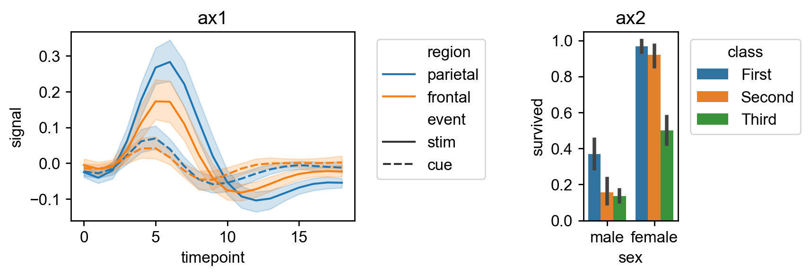

Jupyter Notebook files for all of the example codes are provided in `./example` and also made executable in Google Colaboratory.
- [tutorial1](https://colab.research.google.com/drive/1TVcH3IJy6geDXVJDfOKCPFPsP2GzjxHu?usp=sharing)
- [tutorial2](https://colab.research.google.com/drive/142gBg6Q8hRWTw95yqM5G_P4E2T5pDLrX?usp=sharing)
- [subplot4plotnine](https://colab.research.google.com/drive/17otXpvh-jLn0joI2MwdyT6RKJzx6Anwp?usp=sharing)


## Gallery

**Arrangement of multiple Seaborn plots**
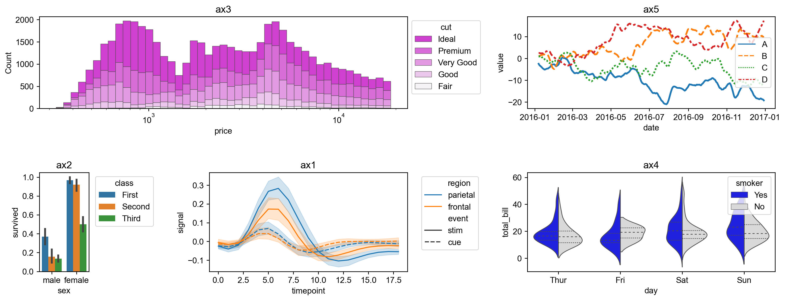

**Arrangement of multiple Plotnine plots**
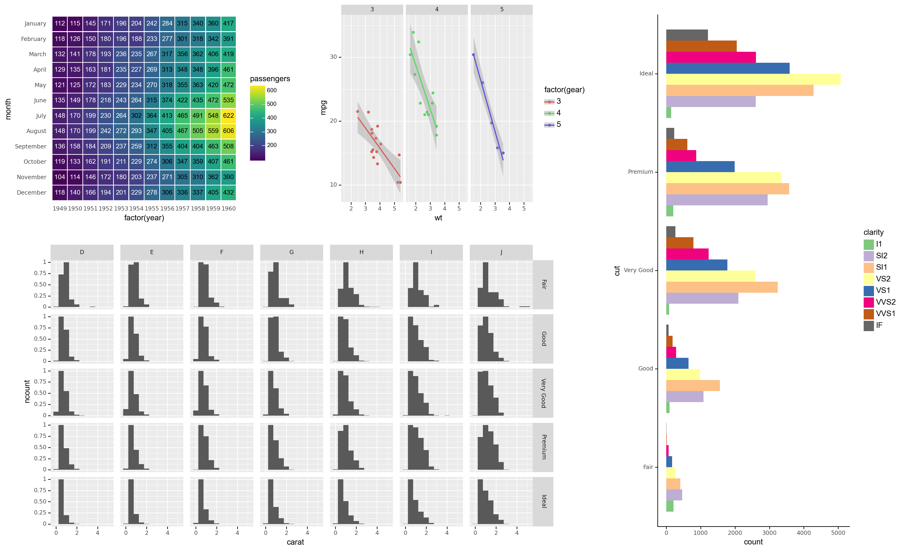

### Getting started

<details>
<summary>Example codes</summary>

**Tutorial \~*Compose multiple seaborn plots*\~**
The follwoing tutorial codes can be executable in [tutorial1](https://colab.research.google.com/drive/1TVcH3IJy6geDXVJDfOKCPFPsP2GzjxHu?usp=sharing)

#### 1. Importing patchworklib library

```python
import patchworklib as pw 
fmri = sns.load_dataset("fmri")
ax1 = pw.Brick("ax1", figsize=(4,2))
sns.lineplot(x="timepoint", y="signal", hue="region", style="event", data=fmri, ax=ax1)
ax1.move_legend(new_loc='upper right')
ax1.set_title("ax1")
```

#### 2. Creating example plots
 
Creating some example plots using the searborn module. Brick class provided by the patchworklib module is implemented as subclass of `matplotlib.axes.Axes`.  Therefore, Brick class object can be given to the seaborn plot functions that have the `ax` parameters.  

When creating a Brick class object, the `label` value should be specified, and it should be unique among the Brick class objects generated in the python script (If the label value is not specified, the unique label name is automatically given. By using `get_label()` method, the value can be confirmed). The `figisize` parameter can also be specified. However, the value is not very important because the figure size and aspect ratio of the Brick class object can be automatically adjusted in arranging the plots. The `savefig(`*`filename=str`*`)` method returns `matplotlib.figure.Figure` class object. If `filename` is given, the figure object can be output to the file.

```python
import seaborn as sns
#Example plot 1 (ref: https://seaborn.pydata.org/examples/errorband_lineplots.html)
fmri = sns.load_dataset("fmri")
ax1 = pw.Brick("ax1", figsize=(4,2))
sns.lineplot(x="timepoint", y="signal", hue="region", style="event", data=fmri, ax=ax1)
ax1.move_legend(new_loc='upper right')
ax1.set_title("ax1")
ax1.savefig()
```

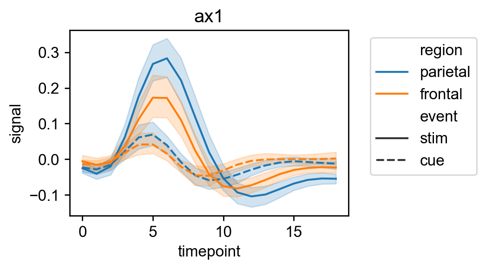

Brick class provides the `movelegend(`*`loc=str, bbox_to_anchor=(float,float)`*`)` method. By using this method, legend location can be quickly modified.

```python
#Example plot 2 (ref: https://seaborn.pydata.org/tutorial/categorical.html)
titanic = sns.load_dataset("titanic")
ax2 = pw.Brick("ax2", figsize=(1,2))
sns.barplot(x="sex", y="survived", hue="class", data=titanic, ax=ax2)
ax2.move_legend(new_loc='upper left', bbox_to_anchor=(1.05, 1.0)) #Original method of Blick class
ax2.set_title("ax2")
ax2.savefig()
```

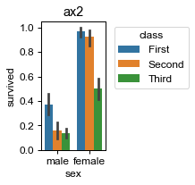

```python
#Example plot 3 (ref: https://seaborn.pydata.org/examples/histogram_stacked.html)
diamonds = sns.load_dataset("diamonds")
ax3 = pw.Brick("ax3", (5,2))
sns.histplot(diamonds, x="price", hue="cut", multiple="stack",
    palette="light:m_r", edgecolor=".3", linewidth=.5, log_scale=True,
    ax = ax3)
ax3.set_title("ax3")
ax3.savefig()
```

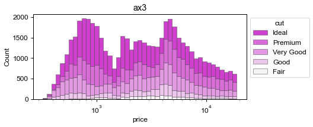

```python
#Example plot 4 (ref:https://seaborn.pydata.org/examples/grouped_violinplots.html)
tips = sns.load_dataset("tips")
ax4 = pw.Brick("ax4", (6,2))
sns.violinplot(data=tips, x="day", y="total_bill", hue="smoker",
    split=True, inner="quart", linewidth=1,
    palette={"Yes": "b", "No": ".85"},
    ax=ax4)
ax4.set_title("ax4")
ax4.savefig("../img/ax4.png")
```

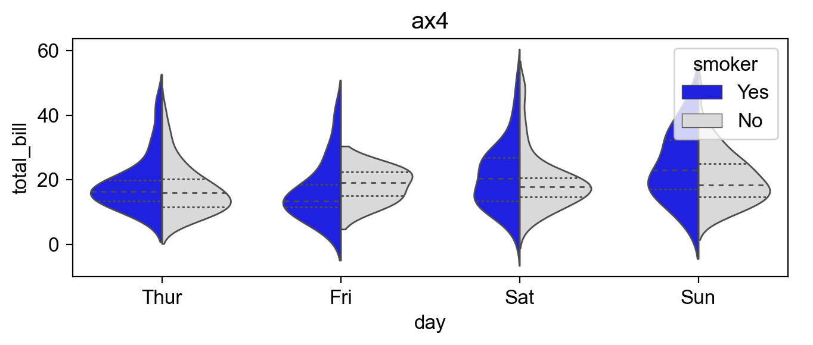

```python
#Example plot 5 (ref:https://seaborn.pydata.org/examples/wide_data_lineplot.html)
rs = np.random.RandomState(365)
values = rs.randn(365, 4).cumsum(axis=0)
dates = pd.date_range("1 1 2016", periods=365, freq="D")
data = pd.DataFrame(values, dates, columns=["A", "B", "C", "D"])
data = data.rolling(7).mean()
ax5 = pw.Brick("ax5", (5,2))
sns.lineplot(data=data, palette="tab10", linewidth=2.5, ax=ax5)
ax5.set_xlabel("date")
ax5.set_ylabel("value")
ax5.set_title("ax5")
ax5.savefig()
```

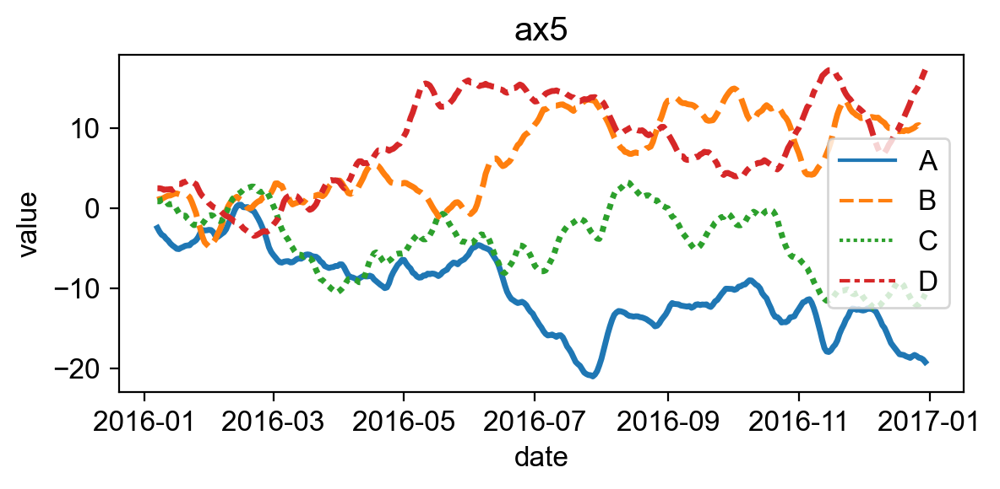

#### 3. Arranging and stacking plots

The patchworklib module provides two operators " `|`", "`/`" that enable designing tidy layout for multiple plots with simple operations. The "`|`" operator will place the plots beside each other, while the "`/`" operator will stack them.

```python
#Arrange "ax1," "ax2," and "ax4" horizontally.
ax124 = ax1|ax2|ax4
ax124.savefig("../img/ax124.png")
```

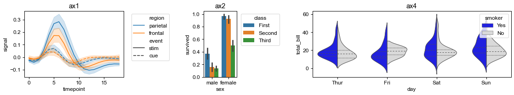

The object generated by arranging multiple Brick object (Bricks class object) can also be arranged and stacked with other Brick objects.  Additionally, It is  possible to create more complex layouts by nesting the operations.

```python
ax12435 = ax124/(ax3|ax5)
ax12435.savefig("../img/ax12435.png")
```

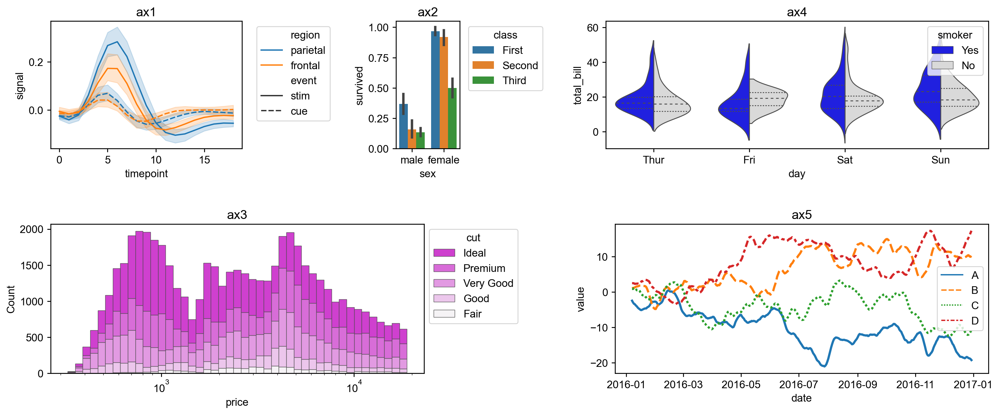

You can quickly test another layout by rearranging them.

```python
ax35214 = (ax3/(ax2|ax1))|(ax5/ax4)
ax35214.savefig()
```


If you want to adjust the margins between objects, please change the value of `.param["margin"]`.

```python
pw.param["margin"]=0.2 #Default value is 0.5.
ax35214 = (ax3/(ax2|ax1))|(ax5/ax4)
ax35214.savefig("../img/ax35214_v1.1.png")
```

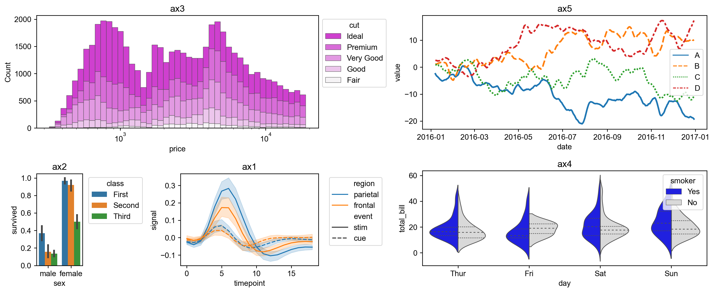

Also, the aspect ratios of each plot can be freely modifiable.

```python
pw.param["margin"]=0.5
ax1.change_aspectratio((4,2))
ax3.change_aspectratio((4,1))
ax4.change_aspectratio((5,2))
ax35214_v2 = (ax3/(ax2|ax1))|(ax5/ax4)
ax35214_v2.savefig()
```

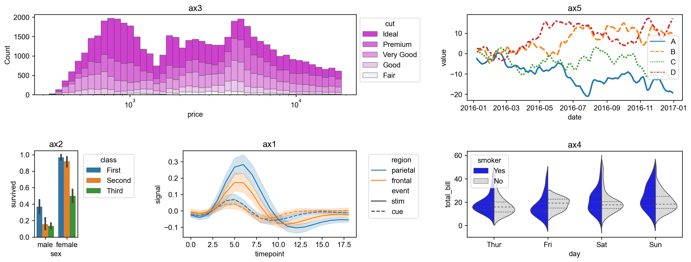

#### 4. Packing plots with label indexing (Advanced method)

By specifying the Brick objects in a Bricks object with their label name, you can adjust the position of another Brick object to be packed. 

```python
ax321 = ax3/(ax2|ax1)
ax321.savefig("../img/ax321.png")
```

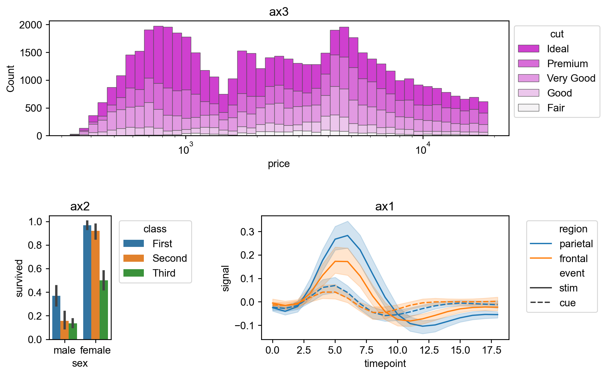

```python
ax3214 = ax321["ax1"]|ax4
ax3214.savefig("../img/ax3214.png")
```

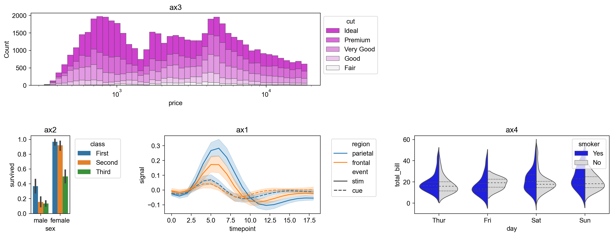

```python
ax35214_v3 = ax3214["ax3"]|ax5
ax35214_v3.savefig("../img/ax35214_v3.png")
```



The above packing process allows the axes of the objects to be accurately aligned with each other. Actually, in "ax35214" and "ax35214_v2", the bottom axis lines of ax3 and ax5 are not precisely aligned, while in "ax35214_v3", their bottom axis lines are exactly aligned. However, please note that this packing method using label indexing changes aspect ratios of the Brick objects to be packed from the original one to align their axis lines with others.

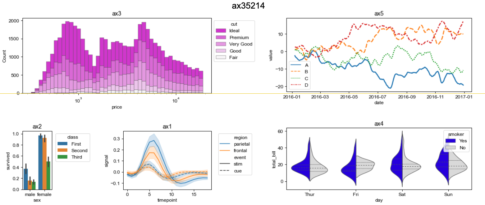

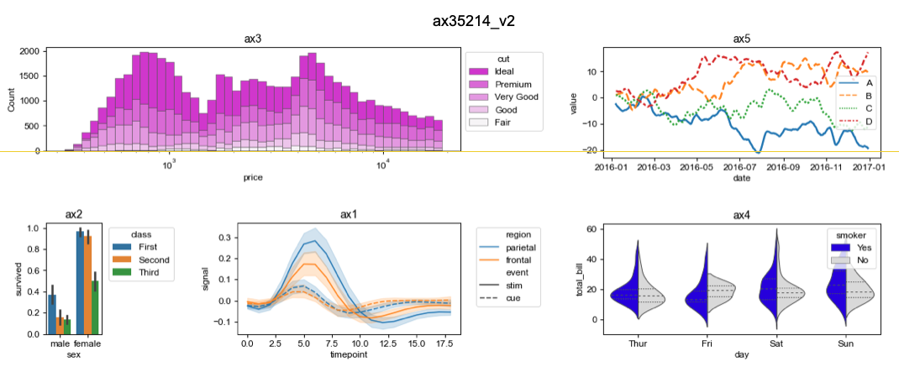


By using the method, [Jointplot](https://seaborn.pydata.org/generated/seaborn.jointplot.html) style layout can be easily designed. Please see [tutorial1](https://colab.research.google.com/drive/1TVcH3IJy6geDXVJDfOKCPFPsP2GzjxHu?usp=sharing) and [tutorial2](https://colab.research.google.com/drive/142gBg6Q8hRWTw95yqM5G_P4E2T5pDLrX?usp=sharing).

</details>
