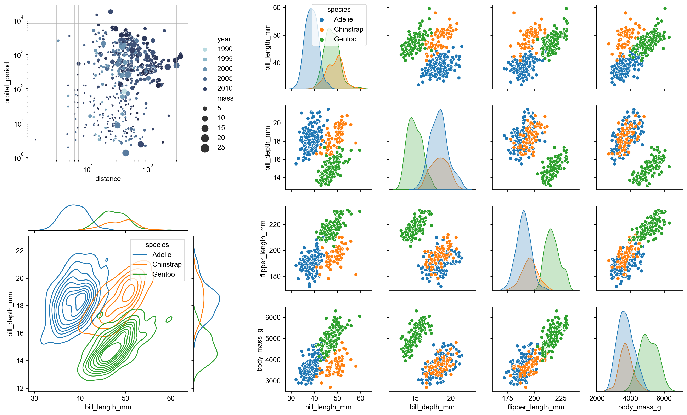
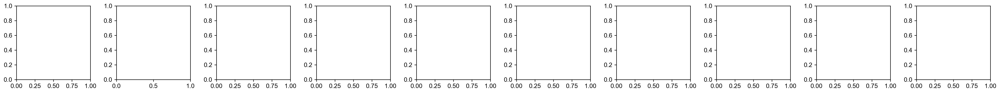
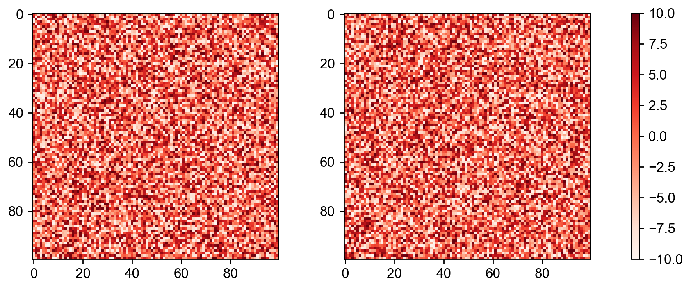
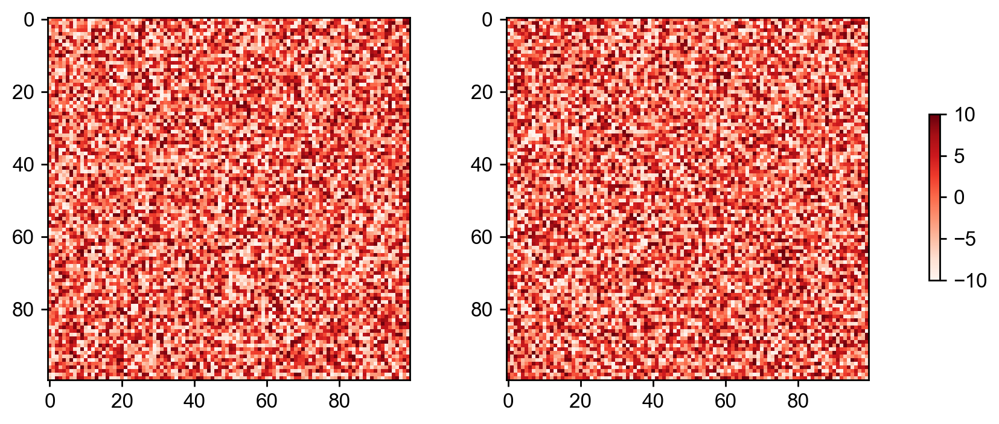
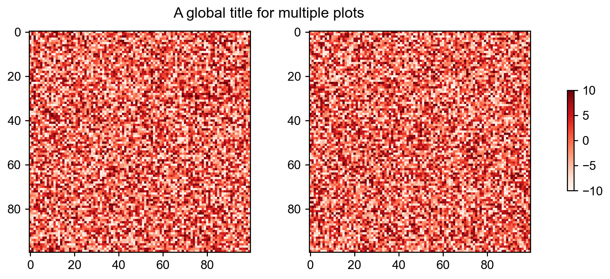
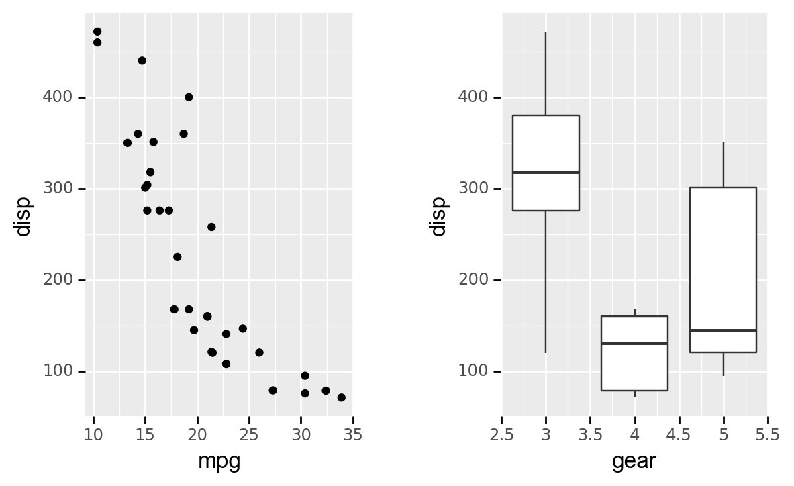

# patchworklib
[Patchworklib](https://github.com/ponnhide/patchworklib) is a universal composer of matplotlib-related plots (simple matplotlib plots, Seaborn plots (both axis-level and figure-level), and plotnine plots). This library is inspired by [patchwork](https://patchwork.data-imaginist.com/) for ggplot2. Accordingly, as original patchwork, users can easily align matplotlib plots with only "/" and "|" operators. Although a good subplot composer, "subplot_mosaic" is provided from matplotlib formally, I believe the way of patchworklib is more straightforward and more flexible.

Additionally, several third-party libraries based on matplotlib, such as plotnine and seaborn, provide functions to generate beautiful plots with simple python codes, but many of those plots cannot be handled as matplotlib subplots. Therefore, their placement must be adjusted manually. Now, scientists spend their valuable time arranging figures.

Patchworklib provides a solution for the problem. By using patchworklib, any kind of seaborn and plotnine plots can be handled as matplotlib subplots.

## Installation
For normal users, we recommended you to install the official release as follows.  
`pip install patchworklib`

If you want to use developmental version, it can be installed using the following single command:  
`pip install git+https://github.com/ponnhide/patchworklib.git`

## News
- Developmental verion on GitHub practically supports plotnine version 0.12.1. 
- Modified `align_xlabels` and `align_ylabels` functions so that they support to align labels on subplots.

#### 05162023: version 0.6.1 is released.
- I could not fully support plotnine version 0.12.1 (It works, but patchworklib arrangement results are not as expected). I will do not support plotnine in the future. 
- Bricks object gained the new methods `align_xlabels` and  `align_ylabels`, which help users align x/y labels of the given Brick object.
- The new argument `equal_spacing` was added to the stack function. If this value is `True`, axes bounding-boxes should be placed with equal spacing between them. Otherwise, depending on the text values of x/y tick labels and x/y labels, they may not always be equally spaced.
- Closed and maybe solved the issue ["Align labels of Bricks when subplot axes are aligned. #40"](https://github.com/ponnhide/patchworklib/issues/40) 
- Closed and maybe solved the issue ["Doesn't work with Plotnine Seaborn Theme. #37"](https://github.com/ponnhide/patchworklib/issues/37)
- Closed and maybe solved the issue ["The position of the title cannot be set in plotnine. #36"](https://github.com/ponnhide/patchworklib/issues/36)

<details> 

<summary> <h2> Change log </h2> </summary>
#### 12082022: version 0.5.0 is released.
- New operators, "+" and "-", were added. 
- plotnine > v0.10.x is now supported.
- Plots generated by object-oriented seaborn interface can now be handled by patchworklib.
- Descriptions of each function and class provided in patchworklib was added to this repository. If you want to know how to use patchworklib in detail, please see [API.md](https://github.com/ponnhide/patchworklib/blob/main/API.md).
- Updated [patchworklib-examples](https://github.com/ponnhide/patchworklib-examples)

#### 08152022: Version 0.4.7 is released. 
- A few bugs were fixed.
- Add inset function. please see the following example. 
- Add `keep_aspect` parameter to `hstack` and `vstack` funciton.
- Example codes were moved to [patchworklib-examples](https://github.com/ponnhide/patchworklib-examples)

<details> 
<summary> Create an inset element </summary>

```python
import patchworklib as pw
from plotnine import *
from plotnine.data import *

g1  = pw.load_ggplot(ggplot(mtcars) + geom_point(aes("mpg", "disp")),figsize=(4, 2))
g2  = pw.load_ggplot(ggplot(mtcars) + geom_boxplot(aes("gear", "disp", group = "gear")) + theme_classic())
g12 = pw.inset(g1,g2)
g12.savefig()
```


```python
g12 = pw.inset(g1,g2, loc="lower left", hratio=0.4, wratio=0.2)
g12.savefig("inset_plotnine2.png")
```


</details>

#### 08092022: Version 0.4.6 is released. 
- A few bugs were fixed (See issue [#18](https://github.com/ponnhide/patchworklib/issues/18)).   
- Plotting speed was improved.

#### 07202022: Version 0.4.5 is released. 
- A few bugs were fixed.
- Modified functions relating to the inheritance of the ggplot theme. If you use patchworklib for handling plotnine plots, please do update.
- When specifying a plot (Brick object) in Bricks object, you can specify the Brick object directly instead of the label name of the Brick object. Please see the following example. 
<details> 
<summary> Alignment of a plotine plot by specifying a Brick object in the Bricks object. </summary>

```python
import patchworklib as pw
from plotnine import *
from plotnine.data import *

g1 = pw.load_ggplot(ggplot(mpg, aes(x='cty', color='drv', fill='drv')) +
                    geom_density(aes(y=after_stat('count')), alpha=0.1) +
                    scale_color_discrete(guide=False) +
                    theme(axis_ticks_major_x=element_blank(),
                          axis_text_x =element_blank(),
                          axis_title_x=element_blank(),
                          axis_text_y =element_text(size=12),
                          axis_title_y=element_text(size=14),
                          legend_position="none"),
                    figsize=(4,1))

g2 = pw.load_ggplot(ggplot(mpg, aes(x='hwy', color='drv', fill='drv')) +
                    geom_density(aes(y=after_stat('count')), alpha=0.1) +
                    coord_flip() +
                    theme(axis_ticks_major_y=element_blank(),
                          axis_text_y =element_blank(),
                          axis_title_y=element_blank(),
                          axis_text_x =element_text(size=12),
                          axis_title_x=element_text(size=14)
                         ),
                    figsize=(1,4))

g3 = pw.load_ggplot(ggplot(mpg) +
                    geom_point(aes(x="cty", y="hwy", color="drv")) +
                    scale_color_discrete(guide=False) +
                    theme(axis_text =element_text(size=12),
                          axis_title=element_text(size=14)
                         ),
                    figsize=(4,4))

pw.param["margin"] = 0.2
(g1/(g3|g2)[g3]).savefig() #By specifying g3 in (g3|g2), g1 is positioned exactly on g3. 

```


</details>

#### 07192022: Version 0.4.3 is released. 
- A few bugs were fixed.  
- `basefigure` parameter was added. You can access the base figure of patchworklib by `patchworklib.basefigure`
- plotnine v0.9.0 was now supported. Probably, it still have some bugs. If you find bugs, please let me know on the issue.

#### 04222022: Version 0.4.2 is released. 
- A few bugs were fixed.  

#### 04182022: Version 0.4.1 is released. 
- `load_seaborngrid` can accepts a `seaborn.clustermap` plot. For details, see example code on [Google colab](https://colab.research.google.com/drive/1wQQyBHLNXJ5Ks6ev88IjXhGfT98SGJuM?usp=sharing)
- A few bugs were fixed.  

#### 03272022: Version 0.4.0 is released. 
- Add docstring for each method and class.  
- Add several new methods of `patchworklib.Bricks` class to set common label, title, spine and colorbar for `Brick` objets in the `Bricks` object.  
　For usage, please refer to the docstring or the example codes on [Google colab](https://colab.research.google.com/drive/1f06AQOqNnSYPjc9EkweC3_Hmy4abr-go?usp=sharing).

#### 02042022: Version 0.3.6 is released. 
- A few bugs relating with the function to arrange multiple polar plot objects.

#### 02042022: Version 0.3.5 is released.
- A few bugs in `move_legend` were fixed. (The `move_legend` for seaborn grided plot was not working properly.)
- Improved the speed of `savefig` operation.

#### 01242022: Version 0.3.3 is released. 
- A few bugs were fixed.
	
#### 01222022: Version 0.3.0 is released.
<details>
<summary> Patchworklib now supports the function to arrange matplotlib.projections.polar.PolarAxes ojbects.  </summary>

When you load a matplotlib.projections.polar.PolarAxes object as a Brick class object, please use 'cBrick' instead of 'Brick'.
Now, you can arrange multiple circos plots using [pycircos](https://github.com/ponnhide/pyCircos) and patchworklib. Please see the following example code.  
https://colab.research.google.com/drive/1tkn7pxRqh9By5rTFqRbVNDVws-o-ySz9?usp=sharing

</details>

#### 01212022: Version 0.2.1 is released.  
- A few bugs for 'load_seaborngrid' were fixed.

#### 01202022: Version 0.2.0 is released.
<details>
<summary> Patchworklib is now possible to arrange Seabron gridded plots. The "stack" function is added. A few bugs were fixed. </summary>
	
#### Arranging seaborn gridded plots 
Patchworklib supported the function to arange multiple seborn plots generated based on axisgrid (FacetGrid, PairGrid, and JointGrid).
Let's see the follwoing example.

```python
import os
import seaborn as sns
import patchworklib as pw
from functools import reduce
pw.overwrite_axisgrid() #When you use pw.load_seagorngrid, 'overwrite_axisgrid' should be executed.

df = sns.load_dataset("penguins")
g1  = sns.pairplot(df, hue="species")
g1  = pw.load_seaborngrid(g1)
g1.move_legend("upper left", bbox_to_anchor=(0.08,1.01))

planets = sns.load_dataset("planets")
cmap = sns.cubehelix_palette(rot=-.2, as_cmap=True)
g2 = sns.relplot(
    data=planets,
    x="distance", y="orbital_period",
    hue="year", size="mass",
    palette=cmap, sizes=(10, 200),
)
g2.set(xscale="log", yscale="log")
g2.ax.xaxis.grid(True, "minor", linewidth=.25)
g2.ax.yaxis.grid(True, "minor", linewidth=.25)
g2.despine(left=True, bottom=True)
g2 = pw.load_seaborngrid(g2)

penguins = sns.load_dataset("penguins")
g3 = sns.jointplot(
    data=penguins,
    x="bill_length_mm", y="bill_depth_mm", hue="species",
    kind="kde",
)
g3 = pw.load_seaborngrid(g3, labels=["joint","marg_x","marg_y"])
((g2/g3["marg_x"])|g1).savefig()
```


Also, some example codes are made executable in Google Colaboratory.
- [seaborn grid](https://colab.research.google.com/drive/1z003LabPwofbsN87xs36FBqKcMgTswO4?usp=sharing)
- [seaborn_ggplot](https://colab.research.google.com/drive/1SPI1jSoH7L0hfX74nuQt4BwY5RKwrXWW?usp=sharing)

#### "stack" fucntion
I implemented the `stack` function. This function allows users to arrange multiple (more than two) Brick or Bricks objects along the specified direction as follows.

```python
import patchworklib as pw
ax_list = []
for i in range(10):
    ax_list.append(pw.Brick(figsize=(2,2), label="ax{}".format(i)))
stacked_axes = pw.stack(ax_list, operator="|", margin=0.2)
stacked_axes.savefig()
```



</details>
	
#### 01142022: Version 0.1.0 was released.  
- Patchworklib was now avialable through pip.

<details>
<summary> <b>01132022: "spacer" class was implemented and "case" parameter was added to Bricks class.</b> </summary>

**Add empty spaces around a plot** 
```python
#preparation of plot data
import numpy as np 
import matplotlib as mpl
import patchworklib as pw

data1 = 20 * np.random.rand(100,100) - 10
data2 = 20 * np.random.rand(100,100) - 10
cmap = mpl.cm.Reds
norm = mpl.colors.Normalize(vmin=-10, vmax=10)
ax1 = pw.Brick("axx", figsize=(3,3))
ax2 = pw.Brick("axy", figsize=(3,3))
ax1.imshow(data1, interpolation='nearest', cmap=cmap, aspect="auto")
ax2.imshow(data2, interpolation='nearest', cmap=cmap, aspect="auto")
```

w/o spacer
```python
ax_cb    = pw.Brick("ax_cb", figsize=(0.1,3))
cb       = mpl.colorbar.ColorbarBase(ax_cb, cmap=cmap, norm=norm)
ax12     = ax1|ax2
heatmap2 = ax12 | ax_cb
heatmap2.savefig()
```


w/ spacer
```python
ax_cb2   = pw.Brick("ax_cb2", figsize=(0.1,1.5))
cb2      = mpl.colorbar.ColorbarBase(ax_cb2, cmap=cmap, norm=norm)
heatmap2 = ax12 | (pw.spacer(ax_cb2,0.5)/ax_cb2/pw.spacer(ax_cb2,0.5))
heatmap2.savefig()
```


**Super titile for multiple plots**  
Sometimes, all that is needed to have common labels and title for multiple plots.   
By specifying `case` parameter of a Bricks class object, common matplotlib artist ojbects for multiple plots can be handled.
```python
ax12.case.set_title("A global title for multiple plots", pad=10)
heatmap2 = ax12|(pw.spacer(ax_cb,0.5)/ax_cb/pw.spacer(ax_cb,0.5))
heatmap2.savefig("")
```


</details>


<details>
<summary> <b>01072022: Patchworklib was updated to allow arranging multiple plots generated by <a href="https://github.com/has2k1/plotnine">plotnine</a>.</b> </summary>

```python
import patchworklib as pw
from plotnine import *
from plotnine.data import *
g1 = pw.load_ggplot(ggplot(mtcars) + geom_point(aes("mpg", "disp")) + theme(figure_size=(2, 3)))
g2 = pw.load_ggplot(ggplot(mtcars) + geom_boxplot(aes("gear", "disp", group = "gear")) + theme(figure_size=(2, 3)))
g12 = g1 | g2
g12.savefig()
```



```python
g3 = pw.load_ggplot(ggplot(mpg, aes(x='displ', y='hwy')) + geom_point() + geom_smooth(span=.3) + theme(figure_size=(2, 3)))
g4 = pw.load_ggplot(ggplot(mtcars) + geom_bar(aes("carb")) + theme(figure_size=(7, 2)))
g1234 = (g1|g2|g3)/g4
g1234.savefig()
```


</details>
</details> 

## Usage
> _If you want to know how to use patchworklib in detail, please see [API.md](https://github.com/ponnhide/patchworklib/blob/main/API.md)._  
>
Using `patchworklib`, you can quickly and freely arrange matplotlib plots with only `|` and `/` oparators as follows.

```python
import patchworklib as pw
import seaborn as sns 

fmri = sns.load_dataset("fmri")
ax1 = pw.Brick(figsize=(3,2))
sns.lineplot(x="timepoint", y="signal", hue="region", style="event", data=fmri, ax=ax1)
ax1.legend(bbox_to_anchor=(1.05, 1.0), loc='upper left')
ax1.set_title("ax1")
 
titanic = sns.load_dataset("titanic")
ax2 = pw.Brick(figsize=(1,2))
sns.barplot(x="sex", y="survived", hue="class", data=titanic, ax=ax2)
ax2.move_legend(new_loc='upper left', bbox_to_anchor=(1.05, 1.0))
ax2.set_title("ax2")

ax12 = ax1|ax2
ax12.savefig("ax12.png")
```


Jupyter Notebook files for all of the example codes are provided in [patchworklib-examples](https://github.com/ponnhide/patchworklib-examples) and also made executable in Google Colaboratory.
- [tutorial](https://colab.research.google.com/drive/1NfjyuKP9nqAM0hanvRHQP-kD1gbmP9Qz?usp=sharing): Basic example codes of patchworklib 
- [subplots for plotnine](https://colab.research.google.com/drive/17otXpvh-jLn0joI2MwdyT6RKJzx6Anwp?usp=sharing): Arranging plotnine plots using patchworklib
- [subplots for seaborngrid](https://colab.research.google.com/drive/1C1EN1-5L2QjnAAVo4vpx_i9knDRzX4jy?usp=sharing): Arranging figure-level seaborn plots using patchworklib
- [placing_super_elements](https://colab.research.google.com/drive/1f06AQOqNnSYPjc9EkweC3_Hmy4abr-go?usp=sharing): Placing super labels and spines for a set of multiple subplots.  
Also, please see https://python.plainenglish.io/a-subplot-manager-for-intuitive-layout-in-matplotlib-bd037fe967f4
## Gallery

**Arrangement of multiple axis-level seaborn plots**


**Arrangement of multiple Plotnine plots**


**Arrangement of multiple figure-level seaborn plots**


### Getting started

<details>
<summary>Example codes</summary>

**Tutorial \~*Compose multiple seaborn plots*\~**
The follwoing tutorial codes can be executable in [tutorial1](https://colab.research.google.com/drive/1TVcH3IJy6geDXVJDfOKCPFPsP2GzjxHu?usp=sharing)

#### 1. Importing patchworklib library

```python
import patchworklib as pw 
fmri = sns.load_dataset("fmri")
ax1 = pw.Brick("ax1", figsize=(4,2))
sns.lineplot(x="timepoint", y="signal", hue="region", style="event", data=fmri, ax=ax1)
ax1.move_legend(new_loc='upper right')
ax1.set_title("ax1")
```

#### 2. Creating example plots
 
Creating some example plots using the searborn module. Brick class provided by the patchworklib module is implemented as subclass of `matplotlib.axes.Axes`.  Therefore, Brick class object can be given to the seaborn plot functions that have the `ax` parameters.  

When creating a Brick class object, the `label` value should be specified, and it should be unique among the Brick class objects generated in the python script (If the label value is not specified, the unique label name is automatically given. By using `get_label()` method, the value can be confirmed). The `figisize` parameter can also be specified. However, the value is not very important because the figure size of Brick class objects can be automatically adjusted in arranging the plots. The `savefig(`*`filename=str`*`)` method returns `matplotlib.figure.Figure` class object. If `filename` is given, the figure object can be output to the file.

```python
import seaborn as sns
#Example plot 1 (ref: https://seaborn.pydata.org/examples/errorband_lineplots.html)
fmri = sns.load_dataset("fmri")
ax1 = pw.Brick("ax1", figsize=(4,2))
sns.lineplot(x="timepoint", y="signal", hue="region", style="event", data=fmri, ax=ax1)
ax1.move_legend(new_loc='upper right')
ax1.set_title("ax1")
ax1.savefig()
```


Brick class provides the `movelegend(`*`loc=str, bbox_to_anchor=(float,float)`*`)` method. By using this method, legend location can be quickly modified.

```python
#Example plot 2 (ref: https://seaborn.pydata.org/tutorial/categorical.html)
titanic = sns.load_dataset("titanic")
ax2 = pw.Brick("ax2", figsize=(1,2))
sns.barplot(x="sex", y="survived", hue="class", data=titanic, ax=ax2)
ax2.move_legend(new_loc='upper left', bbox_to_anchor=(1.05, 1.0)) #Original method of Blick class
ax2.set_title("ax2")
ax2.savefig()
```


```python
#Example plot 3 (ref: https://seaborn.pydata.org/examples/histogram_stacked.html)
diamonds = sns.load_dataset("diamonds")
ax3 = pw.Brick("ax3", (5,2))
sns.histplot(diamonds, x="price", hue="cut", multiple="stack",
    palette="light:m_r", edgecolor=".3", linewidth=.5, log_scale=True,
    ax = ax3)
ax3.set_title("ax3")
ax3.savefig()
```


```python
#Example plot 4 (ref:https://seaborn.pydata.org/examples/grouped_violinplots.html)
tips = sns.load_dataset("tips")
ax4 = pw.Brick("ax4", (6,2))
sns.violinplot(data=tips, x="day", y="total_bill", hue="smoker",
    split=True, inner="quart", linewidth=1,
    palette={"Yes": "b", "No": ".85"},
    ax=ax4)
ax4.set_title("ax4")
ax4.savefig("../img/ax4.png")
```


```python
#Example plot 5 (ref:https://seaborn.pydata.org/examples/wide_data_lineplot.html)
rs = np.random.RandomState(365)
values = rs.randn(365, 4).cumsum(axis=0)
dates = pd.date_range("1 1 2016", periods=365, freq="D")
data = pd.DataFrame(values, dates, columns=["A", "B", "C", "D"])
data = data.rolling(7).mean()
ax5 = pw.Brick("ax5", (5,2))
sns.lineplot(data=data, palette="tab10", linewidth=2.5, ax=ax5)
ax5.set_xlabel("date")
ax5.set_ylabel("value")
ax5.set_title("ax5")
ax5.savefig()
```


#### 3. Arranging and stacking plots

The patchworklib module provides two operators " `|`", "`/`" that enable designing tidy layout for multiple plots with simple operations. The "`|`" operator will place the plots beside each other, while the "`/`" operator will stack them.

```python
#Arrange "ax1," "ax2," and "ax4" horizontally.
ax124 = ax1|ax2|ax4
ax124.savefig("../img/ax124.png")
```


The object generated by arranging multiple Brick object (Bricks class object) can also be arranged and stacked with other Brick objects.  Additionally, It is  possible to create more complex layouts by nesting the operations.

```python
ax12435 = ax124/(ax3|ax5)
ax12435.savefig("../img/ax12435.png")
```


You can quickly test another layout by rearranging them.

```python
ax35214 = (ax3/(ax2|ax1))|(ax5/ax4)
ax35214.savefig()
```


If you want to adjust the margins between objects, please change the value of `.param["margin"]`.

```python
pw.param["margin"]=0.2 #Default value is 0.5.
ax35214 = (ax3/(ax2|ax1))|(ax5/ax4)
ax35214.savefig("../img/ax35214_v1.1.png")
```


Also, the aspect ratios of each plot can be freely modifiable.

```python
pw.param["margin"]=0.5
ax1.change_aspectratio((4,2))
ax3.change_aspectratio((4,1))
ax4.change_aspectratio((5,2))
ax35214_v2 = (ax3/(ax2|ax1))|(ax5/ax4)
ax35214_v2.savefig()
```


#### 4. Packing plots with label indexing (Advanced method)

By specifying the Brick objects in a Bricks object with their label name, you can adjust the position of another Brick object to be packed. 

```python
ax321 = ax3/(ax2|ax1)
ax321.savefig("../img/ax321.png")
```


```python
ax3214 = ax321["ax1"]|ax4
ax3214.savefig("../img/ax3214.png")
```


```python
ax35214_v3 = ax3214["ax3"]|ax5
ax35214_v3.savefig("../img/ax35214_v3.png")
```



The above packing process allows the axes of the objects to be accurately aligned with each other. Actually, in "ax35214" and "ax35214_v2", the bottom axis lines of ax3 and ax5 are not precisely aligned, while in "ax35214_v3", their bottom axis lines are exactly aligned. However, please note that this packing method using label indexing changes aspect ratios of the Brick objects to be packed from the original one to align their axis lines with others.


</details>
