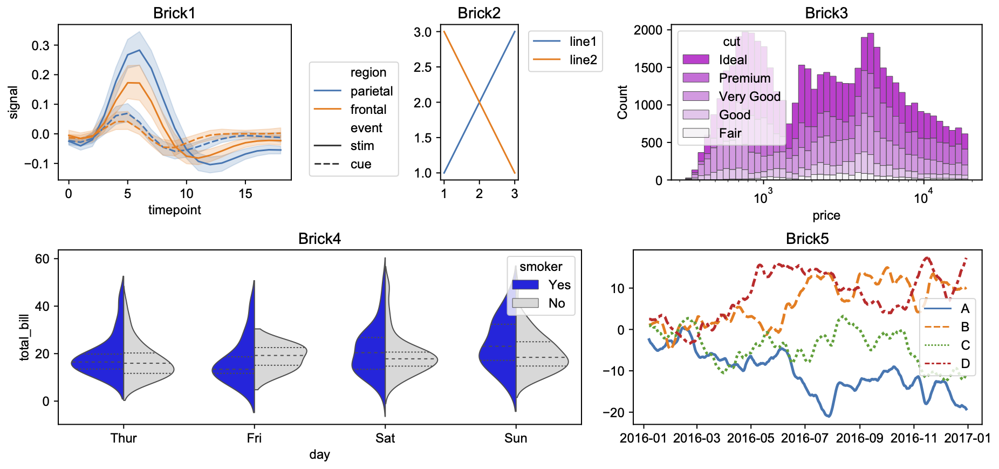
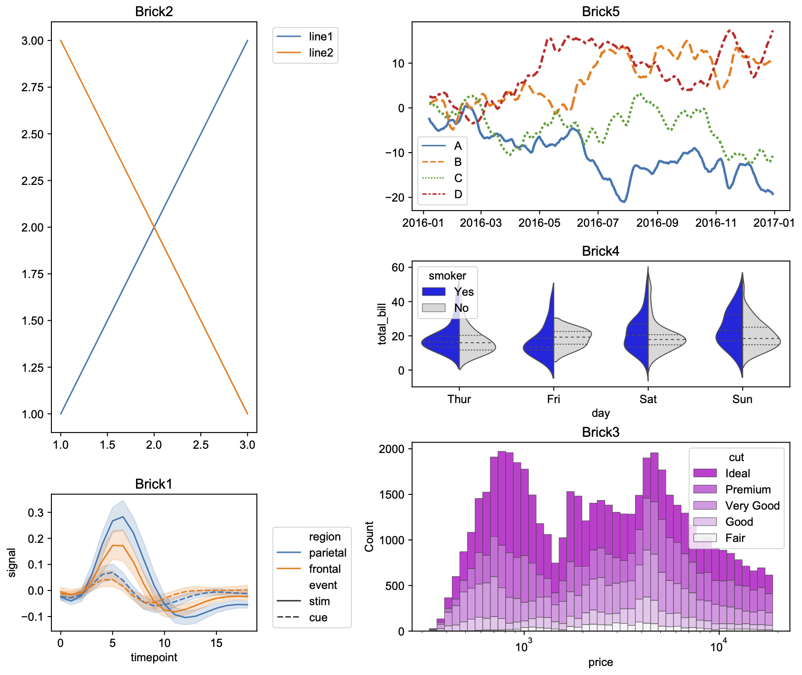

# patchworklib
Actually, matplotlib subplot functions are not optimized for interactive programming environments such as Jupyter-lab. 
This point seems to be discussed in various places (https://twitter.com/kasparmartens/status/1381991445381406722?s=20, https://github.com/has2k1/plotnine/issues/46), and the matplotlib side starts to provide a new function for placing multiple graphs quickly.  
	- [subplot_mosaic]( https://matplotlib.org/stable/tutorials/provisional/mosaic.html#sphx-glr-tutorials-provisional-mosaic-py)  

However, they probably do not understand our hope. We do not wanna think of a layout of multiple graphs before drawing them. After visualizing each graph, we want to try to test multiple layouts for them and find the best layout.
Here, I tried to implement the [patchwork](https://github.com/thomasp85/patchwork) like module for matplotlib. You can quickly design the tidy layout for multiple graophs.

### Demonstration
Some example codes are provided in 
### test code
**Preparation of example plots**
    
```python
import seaborn as sns
import numpy  as np 
import pandas as pd 
    
#Brick1
fmri = sns.load_dataset("fmri")
brick1 = Brick("ax1", aspect=[1.5,1]) 
sns.lineplot(x="timepoint", y="signal", hue="region", 
    style="event", data=fmri, ax=brick1)
brick1.legend(bbox_to_anchor=(1.05, 0.8), loc='upper left')
brick1.set_title("Brick1")

#Brick2
brick2 = Brick("ax2", aspect=[1,2]) 
brick2.plot([1,2,3], [1,2,3], label="line1") 
brick2.plot([3,2,1], [1,2,3], label="line2") 
brick2.legend(bbox_to_anchor=(1.05, 1), loc='upper left')
brick2.set_title("Brick2")

#Brick3
diamonds = sns.load_dataset("diamonds")
brick3 = Brick("ax3", (2,1))
sns.histplot(diamonds, x="price", hue="cut", multiple="stack",
palette="light:m_r", edgecolor=".3", linewidth=.5, log_scale=True,
    ax = brick3)
brick3.set_title("Brick3")

#Brick4
tips = sns.load_dataset("tips")
brick4 = Brick("ax4", (3,1)) 
sns.violinplot(data=tips, x="day", y="total_bill", hue="smoker",
    split=True, inner="quart", linewidth=1,
    palette={"Yes": "b", "No": ".85"},
    ax=brick4)
brick4.set_title("Brick4")

brick5 = Brick("ax5", (2,1)) 
rs = np.random.RandomState(365)
values = rs.randn(365, 4).cumsum(axis=0)
dates = pd.date_range("1 1 2016", periods=365, freq="D")
data = pd.DataFrame(values, dates, columns=["A", "B", "C", "D"])
data = data.rolling(7).mean()
sns.lineplot(data=data, palette="tab10", linewidth=2.5, ax=brick5)
brick5.set_title("Brick5") 
```
    

**Patchwork demo**
```python
bricks1 = (brick1 | brick2 | brick3) / (brick4 | brick5) 
bricks1.savefig("test1.pdf")

bricks2 = (brick2 / brick1) | (brick5 / brick4 /brick3) 
bricks2.savefig("test2.pdf") 
```
    
### Result
**test1**



**test2**  



